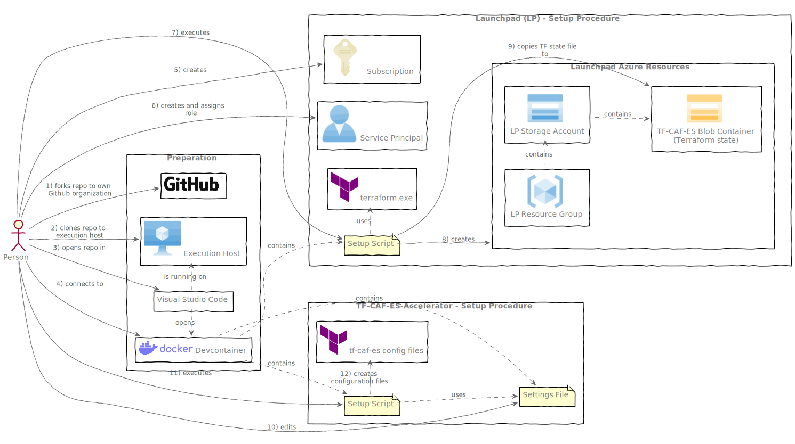

# Terraform CAF Enterprise Scale Accelerator

This repository standardizes and automates:
1) the deployment of an Azure backend storage for Terraform state file management (Launchpad)
2) a bootstrapping procedure for creating Terraform configuration files required by [terraform-azurerm-caf-enterprise-scale](https://github.com/Azure/terraform-azurerm-caf-enterprise-scale)

 

# Setup Procedure

 

## Preparation

 

**1) Fork**
- Fork this repo to your own [Github Organization](https://docs.github.com/en/organizations/collaborating-with-groups-in-organizations/about-organizations).

**2) Clone**
- Clone the forked repository to the machine on which the setup procedure will be executed (e.g. local notebook).

**3) Visual Studio Code**
- [Download](https://code.visualstudio.com/Download) and install Visual Studio Code (VSC).
- Enable [Devcontainer](https://code.visualstudio.com/docs/devcontainers/tutorial) on VSC.

**4) Devcontainer**
- Open VSC and click on the [Explorer](https://code.visualstudio.com/docs/getstarted/userinterface#_explorer) to open your repository. Choose [Reopen in Container](https://code.visualstudio.com/docs/devcontainers/create-dev-container#_add-configuration-files-to-a-repository) when prompted.
- VSC opens your workspace in a devcontainer with access to the script files and executables.

 

## Launchpad

 

**5) Launchpad Azure Subscription**
- Create an Azure [subscription](https://learn.microsoft.com/en-us/azure/cost-management-billing/manage/create-subscription) on which the Launchpad resources will be deployed.

**6) Azure Automation User**
- Create an [Azure Service Principal](https://learn.microsoft.com/en-us/azure/active-directory/develop/howto-create-service-principal-portal) which will be used as an automation user to authenticate to Azure.
- Assign the [Owner](https://learn.microsoft.com/en-us/azure/role-based-access-control/built-in-roles) built-in role to the Service Principal with scope on the [Tenant Root Group](https://learn.microsoft.com/en-us/azure/governance/management-groups/overview).
- Create a Service Principal [secret](https://learn.microsoft.com/en-us/azure/active-directory/fundamentals/service-accounts-principal#service-principal-authentication).

**7) Installation**
- Edit **settings.yaml** according to your needs.
- Start the installation script by executing:
> ./setup-launchpad.sh

**8) Azure Resources**
- The installation procedure will utilize the Terraform executable and configuration files to authenticate to Azure via the previously created Service Principal to deploy the Launchpad resources. Inspect the [main.tf](https://github.com/rigydi/terraform-azurerm-launchpad/blob/main/main.tf) file to see which resources will be deployed.

**9) Terraform State File**
- In the last step of the installation procedure, the installation script will configure the [Azure Backend](https://developer.hashicorp.com/terraform/language/settings/backends/azurerm) to host the [Terraform state file](https://developer.hashicorp.com/terraform/language/state).

 

## Terraform CAF Enterprise Scale Accelerator
 

**10) Settings**
- Adjust **settings.yaml** according to your needs.

**11) Bootstrap Terraform CAF ES**
- Start the script by executing
> ./bootstrap-enterprise-scale.sh

**12) Execute**
- The script creates the corresponding Terraform CAF Enterprise Scale files according to your inputs in **settings.yaml**.
- Adjust the previously created Terraform files if required. Continue by using standard Terraform commands such as 'terraform init' and 'terraform apply'.

 

## Examples

Examples can be found in the [examples](./examples/) folder.

 

## Documentation

Additional documentation can be found in folder [docs](./docs).