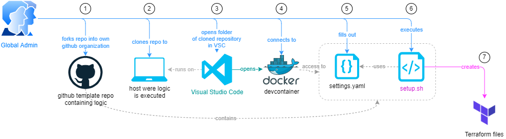

# Terraform CAF Enterprise Scale Accelerator

The content of this repository enables you to create the initial Terraform files for [terraform-azurerm-caf-enterprise-scale](https://github.com/Azure/terraform-azurerm-caf-enterprise-scale) in a standardized and automated way.

# Setup Procedure

**1) Fork**
- Fork this repo to your own [Github Organization](https://docs.github.com/en/organizations/collaborating-with-groups-in-organizations/about-organizations).

**2) Clone**
- Clone the forked repository to the machine on which the setup procedure will be executed (e.g. local notebook).

**3) Visual Studio Code**
- [Download](https://code.visualstudio.com/Download) and install Visual Studio Code (VSC).
- Enable [Devcontainer](https://code.visualstudio.com/docs/devcontainers/tutorial) on VSC.

**4) Devcontainer**
- Open VSC and click on the [Explorer](https://code.visualstudio.com/docs/getstarted/userinterface#_explorer) to open your repository. Choose [Reopen in Container](https://code.visualstudio.com/docs/devcontainers/create-dev-container#_add-configuration-files-to-a-repository) when prompted.
- VSC opens your workspace in a devcontainer with access to the script files and executables.

**5) Settings**
- Adjust the file **settings.yaml** according to your needs.

**6) Setup Script**
- Start the setup script by executing
> ./setup.sh

**7) Execute**
- The script creates the corresponding Terraform CAF Enterprise Scale files according to your inputs in **settings.yaml**.
- Adjust the previously created Terraform files if required. Continue by using standard Terraform commands such as 'terraform init' and 'terraform apply'.

## Examples

Examples can be found in the [examples](./examples/) folder.

## Documentation

Additional documentation can be found in folder [docs](./docs).